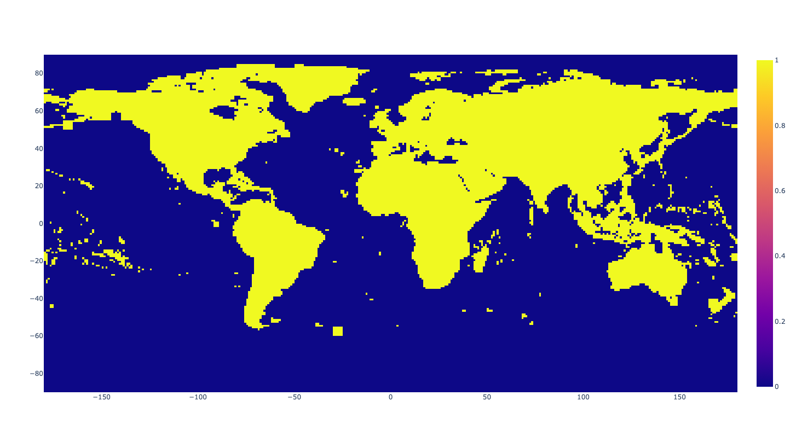

# Gravity-Visualization

This work seeks to visualize the work done by Hirt et al. (2019).
The Readme for their research is [here.](https://ddfe.curtin.edu.au/models/SRTM2gravity2018/SRTM2gravity_Readme.dat)

This project initially started by perusing the [GRACE Tellus Gravity Recovery & Climate Experiment](https://grace.jpl.nasa.gov/data/get-data/)

I also looked at data from:
* [Gravity Predictor Service](https://geodesy.noaa.gov/web_services/grav-d.shtml)
* [CSR Low-Degree Gravity Harmonics GRACE Satellite](https://filedrop.csr.utexas.edu/pub/slr/degree_5/CSR_Monthly_5x5_Gravity_Harmonics.txt)
* [National Centers for Environmental Information (NCEI)](https://www.ngdc.noaa.gov/mgg/gravity/)

# Output
## After

## Before

# How To Use
Please type in the specific location you want and it will show a 3d Histogram and 2d Histogram with your results.

The 2D visualization of all possible locations is here. 

# TODO
* Type in a latitude and longitude and it outputs automatically (if available) without searching for the link. In lieu of this, you may type the link by modifying the code. [All possible links are here.](/filenames.txt)
* The ability to input a square and it will concatenate the multiple location data files together and output the concatenated data
* Create Interactive Globe Model of this to try to imitate the [gravity potato](https://user-images.githubusercontent.com/22484328/223882296-e0e7e285-f51d-4bbb-9c21-b056ce6c29e6.png) Google Earth style

# Thanks
I want to thank (in no particular order):
* Cornelia Freund, Technical University Munich
* Dr. Christian Hirt, Technical University Munich
* Dr. Michael Kuhn, Curtin University
* Dr. John Ries, UT Austin
* Brian Meyer, NOAA

Without you, this project would have gone far more frustratingly
